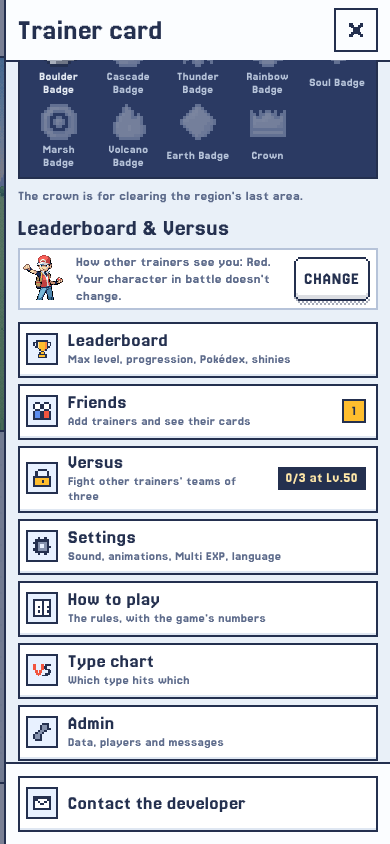
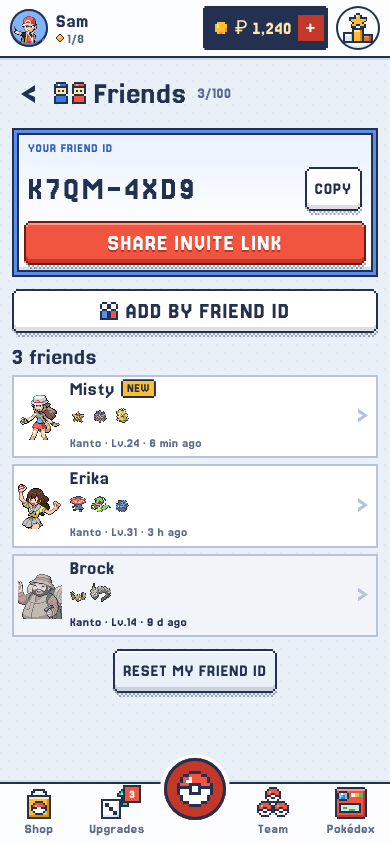
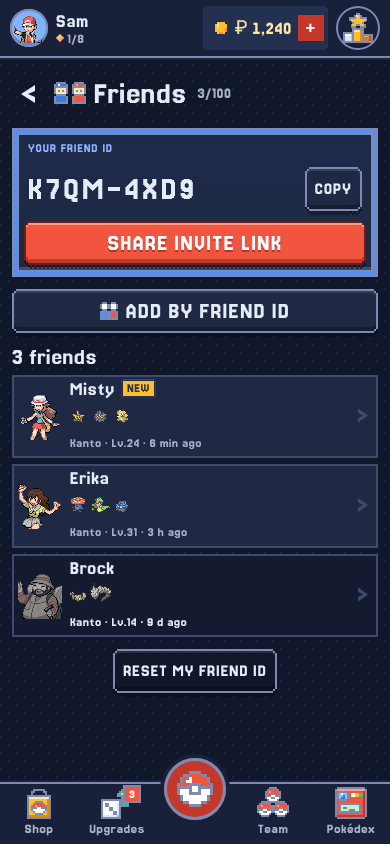
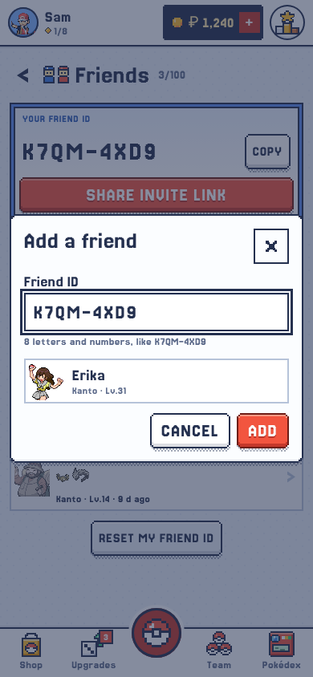
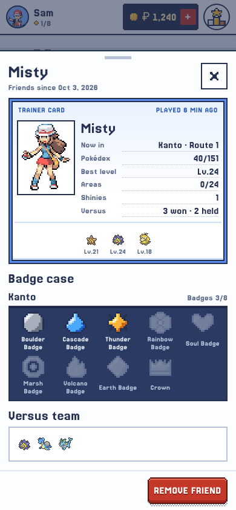
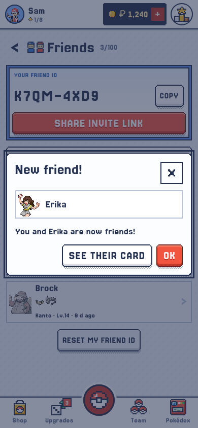
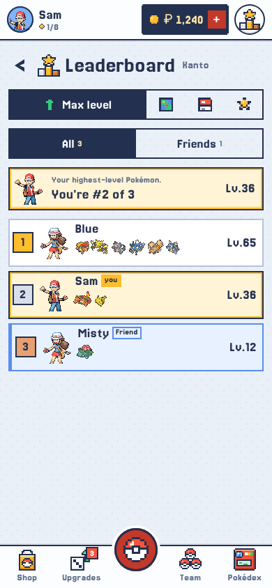
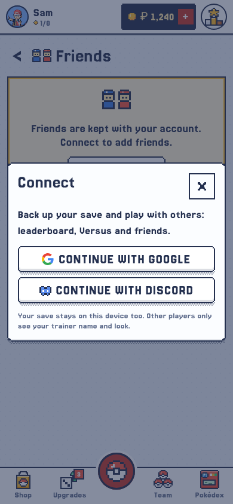
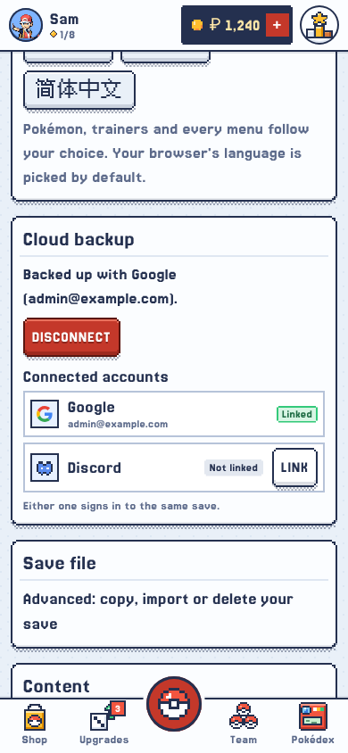

# Pokédice — Friends Plan, with Discord sign-in

> **Status: built** (10 Oct 2026), on top of the *Johto Daybreak* look ([docs/15](15-UI-GUIDELINES.md)), which every
> screen here follows. Where this document and the code disagree, the code is right. What changed in the building is
> just below; decisions are in §12; server load, measured on the live database, is in §8. One fix comes first, and is
> not code: migration 0029 was never applied to the live database (§8.5).

### What changed in the building

- **Daybreak, not the old look.** The mockups below (§4) are screenshots of the screens as built. A friend's card is a
  `Sheet` (Daybreak opens details in a sheet), drawn with the trainer card's own pieces — `CardFrame`, `Stat`,
  `CardTeam`, `BadgeCases`, now exported from `TrainerCard.tsx` — so it looks exactly like yours. Adding a friend, the
  invite pop-ups, removing and resetting are `Modal`s.
- **Friends are sky blue.** Daybreak's blue tint (`sky`, the trainer card's colour) with a blue edge, and a **Friend**
  tag beside the name, as the gold **you** tag sits beside yours: a word, never colour alone. No separate icon on the
  rows. New-friend dots are **gold** (Daybreak: gold for what's new), not red, and the number is in the accessible name.
- **Your friend ID is on your trainer card**, in place of the ID number, once the game knows it.
- **The trainer menu row navigates** to `/friends`, as the Versus row does; the page has Daybreak's back chevron.
- **No `⋯` menu** (Daybreak has none): *Reset my friend ID* is a quiet button at the bottom of the page, with a
  confirmation.
- **`leaderboard()` also returns `friend_id`**, for the caller's friends only, so a friend's row can open their card
  (a button laid over the row; the row's content stays a plain list item).
- **The leaderboard left 0016 for 0033**: `seed.sql` now inlines both, so re-running it never brings the cache back.
- **`versus_board()` reads names from the cards** too (it read every team owner's whole save: 443 ms a call).
- **A new friend is announced once per device**: the toast remembers who it has announced in localStorage; the dots
  stay until the Friends page is opened (`friend_seen()`).
- **Discord's mark** is the game's own pixel icon (as on *Join the Discord*), on a white button like Google's: no
  blurple button, which would break "one red action per screen".
- **Tests run the SQL**: `tests/friends-sql.test.ts` runs the real migrations in PGlite (in-process Postgres, a new
  dev dependency) and checks the card-based board returns exactly the old rebuild's rows.
- Docs moved to **16** and **17**: Daybreak took 14 and 15.

A **Friends page**, opened from the trainer menu (the side drawer). Players add each other with a **friend ID** or an
**invite link**, are told when someone becomes their friend, can open a friend's profile, and see their friends
highlighted on every leaderboard, Versus included. So that friends don't hang on Google alone, players can also sign
in with **Discord** (§2; setup guide: [docs/17](17-DISCORD-SIGN-IN.md)).

---

## The brief, and how each part is met

| Brief | How |
| --- | --- |
| The friend list is its own page, reached from the side menu | `/friends`, a game page like the leaderboard and Versus. The trainer menu gets a **Friends** row under Profile that goes there, as its Versus row goes to `/versus`. Mockups A, B |
| Players share a friend invite link | `https://<site>/f/K7QM4XD9`: the native share sheet on phones, copied to the clipboard on desktop (the `ShareTutorial` pattern). **Opening the link makes the two players friends at once**, after a sign-in if needed. §3.3, mockup D |
| Players share their friend ID and add by friend ID | Every signed-in player has one 8-character ID, `K7QM-4XD9`, shown at the top of the page with COPY. ADD BY FRIEND ID takes one. The link carries the same code. §3.1, mockups B, C |
| A notification when they become friends with someone | A toast when they next open the game or come back to its tab (no Realtime needed). Until they look: a dot on the avatar button and on the Friends row, and a NEW tag on the friend on the page. §3.4, screen A |
| The friend's profile with their info | Tapping a friend opens their trainer card: look, name, last played, where they are, their team, a badge case per region with Pokédex / top level / shinies, and their Versus team. Friends only. Mockup E |
| Removing a friend | From their profile. It removes the friendship for both players, without telling the other. §3.5 |
| Friends highlighted in social features (every leaderboard) | The four region boards, their Hall of Fame, the two Versus boards and the Versus opponents list. A friend's row gets its own tint, a friends icon and "Friend" for screen readers. A **Friends** filter shows only you and your friends, still with your global ranks. Screen F |
| Not relying on Google too much | Sign in with Google **or Discord**. Either opens the cloud save, the leaderboard, Versus and friends; one account can hold both. §2, mockups I, J |

---

## 0. What was found before planning

| Finding | Consequence |
| --- | --- |
| The cloud knows a player by their account (`auth.users`, `saves.user_id`), and today the only way in is Google. A guest is only a random `deviceId` in localStorage, gone when the browser is cleared. The leaderboard and Versus are already account-only. | **Friends need a signed-in account.** This plan adds Discord as a second way in (§2), so that account doesn't have to be Google. A guest still sees the Friends row; the page then shows the connect prompt. A pending invite waits through the sign-in. |
| Every cloud feature keys on `auth.uid()`; nothing in the database reads the provider. Sign-in is one call, `signInWithOAuth({ provider: 'google' })` in `store/sync.ts`, with PKCE. | Discord is mostly a client change: the database, RLS and RPCs work for a Discord account as they are. |
| Six player-facing strings name Google (`ui.account.connectLabel`, `ui.settings.yourGoogle`, `ui.board.connect`, `ui.versus.connect`, `ui.versus.err.versus_signed_out`, the leaderboard tutorial), and `/setup` only covers Google. | They are reworded to "your account" (§2.7), and `/setup` gets an optional Discord step mirroring docs/17. |
| `is_admin()` (0001) compares the session's e-mail with the admin's. | It keeps working with Discord. §2.5 explains why it stays safe, with an optional hardening. |
| `leaderboard()` returns `is_me` but no user id, on purpose. `versus_board()` does return `user_id`. | The database marks friend rows on the region boards (`is_friend`); the browser never sees those ids. Versus compares ids in the browser, because it already has them. |
| The board comes from `leaderboard_cache`, rebuilt by pg_cron every 5 minutes (0031), since the database stalled on 2026-10-07 from reading every save on every visit. | Nothing in this feature may read `saves.data` when a page, board or profile opens. A friend's profile comes from small **player card** rows, kept up to date when their save is written (§5.3). Measured on 10 Oct, that rebuild is still 65% of all database time (§8.1), so the cards go one step further: **the leaderboard reads them too**, and the 5-minute rebuild goes. |
| Migration 0029 (force reload) was never applied to the live database: no `app_signals`, no `force_reload()`, no Realtime policy (checked 10 Oct). | Every tab's join to the `app` channel is refused, which makes Realtime restart every ~10 minutes and the API reload its schema each time: about 15% of database time for nothing (§8.5). Apply 0029 before any of this. |
| 0032 changed `leaderboard()`'s return type, so it had to drop and re-create it. `0016_regions.sql` carries the same pieces so that `seed.sql`, which inlines it, keeps them. | Adding `is_friend` repeats that: drop and re-create in the new migration **and** in `0016_regions.sql`. |
| Leaderboard and Versus are pages inside `GameLayout`. The drawer's Versus row already closes the drawer and navigates (`go('/versus')`). | Friends follows the same pattern: a route inside `GameLayout`, and a row that navigates. |
| Every visible tab joins the private Realtime channel `app` (0029), and `store/sync.ts` already runs a check each time the player comes back to the tab (`checkFreshness`). | Friends use no Realtime at all (§1.7): the new-friend check rides on that return-to-tab hook. |
| `ReplyPopup` already shows "between fights, after Prof. Oak's tutorials, never in a fight". `ShareTutorial` already shares through the share sheet or the clipboard. | The invite result reuses that gating. The share code moves into a helper that both use. |
| Netlify already rewrites `/*` to `index.html`. | `/f/:code` and `/friends` need no hosting change. |
| `PlayerProfileModal` draws the badge case with `regionCases(save, data)`, which only reads each region's `areaProgress` (live and parked). | Split it into `regionCasesFrom(progressByRegion, data)`, so that a friend's card renders with the same `RegionRow`. |
| `players` (0028) has a name and last day for everyone who pings, but no look, and snapshots for guests only. | Not enough for a profile. The card table covers it. |

---

## 1. Decisions

### 1.1 The friend list is its own page

`/friends`, inside `GameLayout`, laid out like the leaderboard (`max-w-3xl`, a big title with its icon). The trainer
menu's **Friends** row closes the drawer and goes there, with the friend count as its hint and a dot for new friends. A
friend's profile and the add dialog are ordinary `Modal`s over the page.

### 1.2 One friend ID, also used in the link

- 8 characters of Crockford base32 (`0–9 A–Z` without `I L O U`), shown as `K7QM-4XD9`. 32⁸ ≈ 1.1 × 10¹² codes, so
  nobody finds a code by guessing, given the rate limit in §5.5.
- Typing is forgiving: any case, spaces and dashes ignored, `O` read as `0`, `I` and `L` read as `1`.
- The database creates the code the first time the player opens Friends (`friend_code()`). The browser never makes one.
- **Reset my friend ID** (in the page's `⋯` menu) issues a new code. Old links and the old ID stop working; existing
  friends stay. That is the fix for "I posted my link on Discord and too many people added me".
- The user id is never shown and never typed.

### 1.3 Friends at once, no request to accept

Having someone's ID or link means they gave it to you. **Opening an invite link makes you friends straight away**, with
no question asked; with an ID, pressing ADD does. The other player is told (§3.4). There is no pending-requests inbox.

What protects players: either side can remove a friend at any time, a reset ID stops new adds, and what a friend sees is
only what the leaderboard already shows everyone, plus the badge case and the Versus team (mockup E). Nothing private:
no e-mail, no Google or Discord name or picture, no gold or inventory.

### 1.4 Mutual, at most 100, removed for both

One row per pair: if A is B's friend, B is A's friend. At most **100 friends** each, through a new `game_config` key
`maxFriends` (Admin → Config, default 100). An add that would take either side over the cap fails with a clear message.
Removing a friend deletes the pair, so it is gone from both lists.

### 1.5 Profiles for friends only

Only a friend's row opens a profile: on the Friends page, and on the boards. Other players' rows stay as they are, and
`friend_profile()` returns nothing for someone who isn't the caller's friend.

### 1.6 Every leaderboard, Versus included

The region boards (all four tabs and the Hall of Fame), the Versus attack and defense boards, and the Versus opponents
list all get the friend treatment.

### 1.7 Notifications stay in the game

A toast, a dot and a NEW tag. No e-mail and no web push: the game has no service worker, and a permission prompt for
this is not worth it (§11).

**When the toast comes** (decided 10 Oct): when the game loads, and when the player comes back to its tab, at most
every 5 minutes. Both run the tiny `friend_status()` call (§5.4). Friends use **no Realtime**: no extra channel join,
no broadcast. A player who keeps the tab in front the whole time sees a new friend at their next tab switch or reload.
That is the trade for the lightest option (§8.3).

### 1.8 Sign in with Google or Discord

Both providers open the same things; a player can link both to one account. Details in §2.

---

## 2. Sign-in with Discord

### 2.1 What it covers

Everything that needs an account works the same with Discord, because it all keys on `auth.uid()`: the cloud save and
SYNC ONLINE, the leaderboard, Versus, Contact the developer → My messages, and friends. No SQL changes for it. The
community already lives on Discord (the trainer menu's Join the Discord row), so it is the natural second way in.

### 2.2 Setting it up

Step by step in **[docs/17 — Discord sign-in: setup guide](17-DISCORD-SIGN-IN.md)**: a Discord application with
Supabase's callback as its redirect, then Discord switched on in Supabase with the client ID and secret, and **Allow
manual linking** on. No new environment variable and no Netlify change. It can be done before the game has the button,
and checked on its own (docs/17, part 4).

`/setup` gets the same as an optional step after Google ("Discord, optional"), a Verify line "Discord sign-in is on"
(shown as *not set*, not as a failure, while it is off), and the Discord rows of docs/17's troubleshooting.

### 2.3 The CONNECT chooser, and which providers are on

- Every CONNECT in the game (title screen, trainer menu, leaderboard banner, Versus, the Friends page, the invite
  pop-up) opens a small chooser: **Continue with Google**, **Continue with Discord** (mockup I).
- The game asks Supabase which providers are on: `GET <SUPABASE_URL>/auth/v1/settings` with the anon key returns
  `external: { google: true, discord: false, … }`. It is kept in localStorage for 24 hours, so it costs about one call
  per player per day; if it fails, the game assumes Google only, which is today's behaviour.
- With only Google on, CONNECT signs in with Google directly, as today: no chooser, no extra tap. Discord shows up by
  itself the moment it is switched on in Supabase, and disappears if it is switched off.

### 2.4 One account, two ways in

- **Same verified e-mail** on Google and Discord: Supabase links them on its own, so it is one account and one save.
- **Different e-mails**: **Settings → Connected accounts** (mockup J) → **LINK** calls
  `supabase.auth.linkIdentity({ provider, options: { redirectTo } })`. After Discord's (or Google's) screen the player is
  back with both listed, and either button signs in to the same save. **UNLINK** (`unlinkIdentity`) only shows while
  both are linked: the last way in can't be removed.
- **Linking an account that already has its own Pokédice account** is refused by Supabase ("Identity is already linked
  to another user"). The game says: "This Discord account already has its own save. Sign in with Discord to play it."
  No merge of saves (§11).
- Two accounts that were never linked are two players: two saves, two friend IDs, two friend lists, two places on the
  boards. Settings shows which provider and e-mail the current account uses, so a player can tell.

### 2.5 Admin rights

`is_admin()` checks the account's e-mail, whichever provider signed in, and keeps working unchanged. Supabase only takes
an e-mail that Discord reports as verified (for an unverified one it asks for a confirmation e-mail first), so a Discord
account can carry the admin e-mail only if its owner controls that inbox. If the admin's Discord uses the same e-mail,
Supabase links it to the admin's existing account.

Optional hardening, so that admin rights don't depend on e-mails at all: pin `is_admin()` to the admin's user id
(`select auth.uid() = '<admin-user-id>'::uuid`), in a migration and in `0001_init.sql`. The front end's
`VITE_ADMIN_EMAIL` stays as it is: it only decides whether the Admin link shows.

### 2.6 Code changes

| File | Change |
| --- | --- |
| `src/store/sync.ts` | `signInWithGoogle()` becomes `signIn(provider: 'google' \| 'discord')`, same `redirectTo`, same `flushWrite()` first. New `linkProvider(provider)` and `unlinkProvider(provider)`. `handleSession` also stores `provider` (`app_metadata.provider`) and `providers` (from `user.identities`) in `auth`. The avatar already reads `user_metadata.avatar_url`, which Discord fills too. |
| `src/lib/authProviders.ts` (new) | `fetchAuthProviders()` from `/auth/v1/settings`, kept 24 hours in localStorage (read in a try/catch); `useAuthProviders()` hook. |
| `src/components/GoogleAccountButton.tsx` → `AccountButton.tsx` | `ConnectButton` opens the chooser (or signs in with Google straight away when Discord is off). `GoogleMark` stays; a `DiscordMark` joins it (the official white logo, on Discord's blurple `#5865F2`). The disconnect confirmation names the provider: "Backed up with Discord (ash@…)". |
| `src/components/ConnectModal.tsx` (new) | The chooser (mockup I). |
| `src/components/PlayerMenu.tsx` | The Connect row opens the chooser and shows both marks. |
| `src/screens/Settings.tsx` | The cloud section becomes **Connected accounts** (mockup J). |
| `src/screens/Leaderboard.tsx`, `Versus.tsx` | Their connect banners open the chooser. |
| `src/setup/SetupPage.tsx` | The optional Discord step, the Verify line, the troubleshooting rows (§2.2). |
| `src/lib/leaderboard.ts` | The header comment's "Google-signed-in players only" becomes "signed-in players". |
| `e2e/helpers.ts` | `mockSupabase` answers `/auth/v1/settings` and `/auth/v1/authorize?provider=discord`. |

### 2.7 Wording

The six strings that name Google say "your account" instead ("Connect to take part", "Connect to set a team and
fight", …), in all 11 columns. New rows: the chooser's title, body and two buttons, the Connected accounts block
(linked, not linked, LINK, UNLINK, the already-linked error), and the provider names. About 15 rows.

---

## 3. Friends flows

### 3.1 Add by friend ID

1. Trainer menu → Friends → **ADD BY FRIEND ID**.
2. Type or paste `K7QM-4XD9`. The field formats the code as it is typed. At 8 valid characters it calls
   `friend_lookup(code)` (debounced) and shows who it is, so the player can check they have the right trainer
   before adding.
3. **ADD** → `friend_add(code)`:

| Result | What the player sees |
| --- | --- |
| `added` | The dialog closes, toast "You and MISTY are now friends!", Misty at the top of the page with NEW. Misty is told (§3.4). |
| `already` | "MISTY is already your friend." |
| `self` | "That's your own friend ID." |
| `not_found` | "No trainer has this friend ID." (a reset code too) |
| `full` | "Your friend list is full (100)." or "MISTY's friend list is full." |
| `rate_limited` | "Too many tries. Wait a few minutes." |

### 3.2 Share the link or the ID

- **SHARE INVITE LINK** → `navigator.share({ title: 'Pokédice', text: 'Add me on Pokédice! Friend ID K7QM-4XD9', url })`
  with `url = location.origin + '/f/K7QM4XD9'`, so a preview deploy shares preview links. No share sheet (desktop) → the
  link is copied, toast "Invite link copied".
- **COPY** next to the ID → copies `K7QM-4XD9`, toast "Friend ID copied".
- The player's own profile (`PlayerProfileModal`) also shows the ID with COPY, so it can be found outside Friends too.

### 3.3 Opening an invite link: friends at once

`/f/:code` is a route outside `GameLayout`, because it must work for someone with no save. It:

1. normalises the code and stores `{ code, at }` under localStorage `pokedice.friendInvite`, kept 7 days, so it
   survives the OAuth redirect and a new game;
2. replaces the URL with `/friends` if there is a save, or `/` if there isn't.

`FriendInviteHandler`, mounted in `GameLayout` next to `ReplyPopup`, then deals with the invite once the run is idle
(never mid-fight) and no Prof. Oak tutorial is due:

| The player | What happens |
| --- | --- |
| Signed in | `friend_add(code)` **straight away, nothing to confirm**. A pop-up says "You and MISTY are now friends!" with Misty's look, **OK** and **SEE PROFILE** (mockup D). Misty is told (§3.4). |
| Has a save, signed out | "MISTY invited you to be friends. Connect to accept." **NOT NOW** / **CONNECT** (the chooser, §2.3). Back from the sign-in, the add happens on its own, as in the row above. |
| Has no save (new to the game) | The title screen shows a ribbon, "MISTY invited you to Pokédice!", under the logo. Once they are in a game (after the new-game intro: check it doesn't stack on Prof. Oak's first lines), one of the two rows above applies. |
| Own code, unknown code, already friends, a full list | A toast with the reason (§3.1's texts); the invite is dropped. |

The pop-ups name the sender with `friend_lookup(code)`, which a signed-out player can call too; it returns a name, look,
current region and top level only. NOT NOW drops the invite; opening the link again brings it back. On a deployment
without Supabase, `/f/…` just goes on to `/`.

### 3.4 Being told

When B adds A, by ID or by link:

- **A's game is open**: the pair is stored as unseen by A. The next time A comes back to the game's tab (at most
  every 5 minutes), `friend_status()` reports it, and A gets a good-tone toast, "MISTY is now your friend!" (held until
  a fight in progress ends). Nothing is pushed to A's browser (§1.7).
- **A is away**: the pair is stored as unseen by A. The next time A's game loads, once sign-in has settled (when
  `ReplyPopup` loads its inbox), the tiny `friend_status()` call (§5.4) reports it: one toast, "MISTY is now your
  friend!" or "3 new friends!". The full list is only fetched when the Friends page opens.
- Either way, until A opens the Friends page: a red dot on the avatar button in the top bar, a dot with the count on
  the Friends row in the trainer menu, and NEW on each new friend. Opening the page calls `friend_seen()`. The dots go
  at once; the NEW tags stay until A leaves the page, so A can still see who is new.
- B, who did the adding, gets only the success message.

### 3.5 Removing

Friend profile → **REMOVE FRIEND** → "Remove MISTY from your friends? You'll disappear from each other's list. They
won't be told." → `friend_remove(id)`. The pair is deleted, so both lists drop it at once (the other player's on their
next refresh). Their rows lose the friend treatment on the boards. Becoming friends again needs the ID or a link again.

---

## 4. Screens (Daybreak, as built)

Screenshots of the real screens at 390×844, with the e2e mocks (`e2e/friends.spec.ts` drives the same screens). They
replace the ASCII mockups of the first drafts, which predated the Daybreak look.

| | |
| --- | --- |
|  | **A. The trainer menu.** Under the trainer card (your friend ID in place of the ID number), a **Friends** row with Daybreak's icon tile and a one-line description. A gold dot with the number of new friends, on the row and on the avatar in the top bar; otherwise the row's hint is how many friends you have. |
|  | **B. The Friends page** (`/friends`). The back chevron, the friends icon and the count (`3/100`). Your friend ID on a sky card with **COPY**, and the page's one red action, **SHARE INVITE LINK**. **ADD BY FRIEND ID** below. Each friend is a row-button: look, name, **NEW** (gold) while new, their team as menu icons, then region · level · when they last played; away more than 72 h, the row is grey. **Reset my friend ID** waits quietly at the bottom. |
|  | **B′. At dusk.** The same page in the dark theme: every colour is a theme token, and the contrast check runs on it (`e2e/friends.spec.ts`). |
|  | **C. Add by friend ID.** A field that reads any case, spaces and dashes, and shows `K7QM-4XD9`. At 8 good characters it shows who it is, so the player can check before **ADD**. "No trainer has this friend ID." in red under the field when nobody has it. |
|  | **E. A friend's card** (a sheet). Their name, "Friends since …", then the blue trainer card: their look at 2×, "Played …", where they are now, Pokédex, best level, areas, shinies, Versus record, their team. Their badge cases, region by region, as on yours. Their Versus team. **REMOVE FRIEND** in the footer, with a confirmation: gone for both, and the other isn't told. |
|  | **D. After opening an invite link.** Signed in, the two are friends before this shows: **SEE THEIR CARD** or **OK**. Signed out, the pop-up names who sent it and offers **CONNECT** (or *Not now*); without a game yet, the title screen shows a sky ribbon, "Misty invited you to Pokédice!". |
|  | **F. The boards.** A friend's row is sky blue with a blue edge and a **Friend** tag; it opens their card. **ALL / FRIENDS** (with counts), shown once you have friends, keeps the whole board's ranks. The same on the Hall of Fame and both Versus boards; in Versus, friends' teams come first among those still to beat. |
|  | **I. CONNECT, with Discord on.** *Continue with Google* and *Continue with Discord*, two white buttons with their marks, and what other players will see. With Discord off in Supabase, CONNECT skips this and goes to Google. |
|  | **J. Settings → Cloud backup.** "Backed up with Google (…)", then **Connected accounts**: each way in, Linked (green) or Not linked with **LINK**; **UNLINK** only while both are linked. |

---

## 5. Database: `supabase/migrations/0033_friends.sql`

Safe to run again, like the others. Nothing in it depends on the sign-in provider. Every table has row level security
on and `revoke all … from anon, authenticated`. Only the `security definer` functions below touch them (the
`leaderboard_cache` pattern), plus an `is_admin()` policy for the admin.

### 5.1 Tables

```sql
-- Each signed-in player's friend ID: 8 characters of Crockford base32.
create table if not exists friend_codes (
  user_id uuid primary key references auth.users(id) on delete cascade,
  code text not null unique check (code ~ '^[0-9A-HJKMNP-TV-Z]{8}$'),
  created_at timestamptz not null default now()
);

-- One row per pair of friends, the smaller id first.
create table if not exists friendships (
  user_a uuid not null references auth.users(id) on delete cascade,
  user_b uuid not null references auth.users(id) on delete cascade,
  added_by uuid not null,
  created_at timestamptz not null default now(),
  a_seen boolean not null default false,   -- user_a has seen that they are friends (the adder's is set at once)
  b_seen boolean not null default false,
  primary key (user_a, user_b),
  check (user_a < user_b)
);
create index if not exists friendships_b on friendships (user_b);

-- What other players may see of you, kept up to date by a trigger on saves (§5.3). One row per player…
create table if not exists player_cards (
  user_id uuid primary key references auth.users(id) on delete cascade,
  name text not null,
  avatar text not null,
  region text not null,     -- the region they are playing now
  area_id text,
  updated_at timestamptz not null   -- the save's: "played 2 h ago", and the leaderboard's 72-hour rule
);
create index if not exists player_cards_updated_at on player_cards (updated_at desc);

-- …and one per player and region played: exactly what a leaderboard row needs, plus the badges for the profile.
create table if not exists player_card_regions (
  user_id uuid not null references player_cards(user_id) on delete cascade,
  region text not null,
  team jsonb not null,      -- [{dex, level, shiny}], that region's team
  pokedex int not null,
  max_level int not null,
  shinies int not null,
  progress jsonb not null,  -- {areaId: {cleared, gyms}}, as leaderboard() returns it today
  badges text[] not null,   -- the gym leaders beaten whose `badge` is set: the badge case, and the board's badge rule
  endgame boolean not null, -- the league area cleared: the crown
  primary key (user_id, region),
  constraint player_card_regions_small check (pg_column_size(progress) < 16000)
);

-- Lookups and adds, for the rate limit (§5.5). Pruned to the last hour as it goes.
create table if not exists friend_attempts (
  actor text not null,      -- user id, or 'device:<id>' for a signed-out lookup
  at timestamptz not null default now()
);
create index if not exists friend_attempts_actor on friend_attempts (actor, at desc);
```

### 5.2 Friend IDs

`friend_code()` returns the caller's code, creating it with `extensions.gen_random_bytes` (pgcrypto, on in Supabase)
and trying again on a unique violation. `friend_code_reset()` replaces it, at most once an hour.

### 5.3 Player cards, which also become the leaderboard

- `player_card_write(p_user uuid, p_data jsonb, p_at timestamptz)` builds the card from a save and writes it: the
  `player_cards` row, and one `player_card_regions` row per region (the regions the save no longer has are deleted).
  It uses the same JSON paths as `leaderboard_rows` (the live region plus every `parked` one), but with **no badge
  filter**, so a region shows on a profile before its first badge, and it also keeps the badge **ids** and the crown.
- Trigger `saves_card`, `after insert or update of data on saves`, calls it. That is one pass over a save already in
  memory, once per cloud push: about 2,200 pushes in 10 hours today, an estimated 8 ms each (§8.2). Pushes happen at
  most every `cloudSyncMinutes`, and no-op pushes are already skipped.
- The migration ends with a backfill: `select player_card_write(user_id, data, updated_at) from saves`. That is one
  pass over the 1,355 saves, once (an estimated 10–15 s; run it off-peak).
- **The leaderboard reads the cards.** `leaderboard()` keeps its columns, but its rows come from
  `player_card_regions` joined to `player_cards`, with the same rules as 0032: played in the last 72 hours (the card's
  `updated_at`), at least one badge in the region (`badges` not empty), not banned, plus the caller's own rows at any
  age. That is about 800 small rows instead of 458 saves, so there is no cache to rebuild:
  `leaderboard_cache`, `leaderboard_cache_state`, `leaderboard_rows()`, `leaderboard_rebuild()`,
  `leaderboard_refresh()` and the `leaderboard-rebuild` pg_cron job are retired (the job unscheduled, the tables
  dropped at the end of the migration once the new `leaderboard()` answers). The caller's own rows also come from their
  card: it is exactly as fresh as their last push, which is what the saved row is anyway.
- `0016_regions.sql`, which `seed.sql` inlines, gets the same `leaderboard()` and loses the cache pieces, so that
  re-running `seed.sql` doesn't bring the rebuild back.

### 5.4 Functions

All are `security definer set search_path = public` and need `auth.uid()`, except `friend_lookup`. They are granted to
`authenticated`, and `friend_lookup` to `anon` as well.

| Function | What it does |
| --- | --- |
| `friend_code() → text` | The caller's ID, created on the first call. |
| `friend_code_reset() → text` | A new ID; old links stop working. Once an hour. |
| `friend_lookup(p_code text, p_device_id text) → (name, avatar, region, max_level)` | What an invite and the ADD dialog preview. Open to signed-out players, because a link can be opened before signing in. Rate limited (§5.5). |
| `friend_add(p_code text) → (status, user_id, name, avatar)` | The statuses of §3.1. Inserts the pair (`least` / `greatest`), marks it seen for the caller; the other side learns it from `friend_status()` (§3.4). Used by ADD and by an invite link alike. |
| `friend_remove(p_friend uuid) → void` | Deletes the pair, from either side: gone for both. |
| `friend_status() → (ids uuid[], unseen jsonb)` | The one friends call at game load: the friend ids (for the Versus highlight) and the new friends' names and looks (for the toast). A few hundred bytes. |
| `friend_list() → setof (user_id, name, avatar, region, area_id, max_level, team, since, updated_at, is_new)` | The Friends page only. One row per friend: friendships joined to the cards. No save is read. A friend without a card yet comes back as "Trainer" with no game. |
| `friend_profile(p_friend uuid) → (card…, versus_team, attack_wins, defense_wins)` | The friend's whole card and their Versus team (`versus_teams`), only if they are the caller's friend; otherwise nothing (§1.5). |
| `friend_seen() → void` | Marks the caller's unseen friendships as seen. |

### 5.5 Limits and abuse

- **Rate limit:** at most 20 `friend_lookup` + `friend_add` calls per 10 minutes per player (per device id for a
  signed-out lookup, a soft key, as for feedback). With 10¹² codes, guessing gets nowhere anyway; this is mostly
  against a stuck button.
- **Cap:** `maxFriends` (`game_config`, default 100) is checked for both players inside `friend_add`, under a
  `pg_advisory_xact_lock` on each of the two user ids, so two adds at once can't both get past the cap.
- **Leaderboard bans** (`leaderboard_bans`): a banned player stays a friend and keeps their profile. They are only off
  the boards, as today.
- **Deleted accounts:** every table cascades from `auth.users`.

### 5.6 No Realtime

Friends add no Realtime topic, policy or broadcast (§1.7). New friends are found by `friend_status()`, at game load
and on return to the tab.

### 5.7 The leaderboard flag

The new `leaderboard()` (§5.3) also gains `is_friend boolean`. It works out the caller's friends once (100 rows at
most) and joins them by hash against the board, rather than probing `friendships` for each of up to 3,000 rows:

```sql
with mine as (
  select case when f.user_a = auth.uid() then f.user_b else f.user_a end as id
  from friendships f
  where f.user_a = auth.uid() or f.user_b = auth.uid()
)
select …, (m.id is not null) as is_friend
from ( …the board, from the cards… ) r
left join mine m on m.id = r.user_id
```

The return type changes, so: drop and create, as 0032 did, and the same in `0016_regions.sql` so that re-running
`supabase/seed.sql` keeps it. `parseLeaderboard` reads a missing `is_friend` as false (a database that hasn't run 0033).

Versus needs no SQL change: `versus_board()` already returns `user_id`.

### 5.8 Deploying

- **First, apply 0029** on the live database if it still isn't (§8.5). Friends don't need it, but the reload loop it
  fixes is the second-biggest load on the database.
- A README "Rule additions" entry: "Needs `supabase/migrations/0033_friends.sql` run once on the live database
  (re-running `supabase/seed.sql` brings the leaderboard part). It replaces the leaderboard cache and its pg_cron job
  with player cards." Another for Discord sign-in, pointing to docs/17.
- After running it: check the board against the old one (§9), then watch Admin → Analytics and the database's query
  stats for a day.
- `pnpm seed-sql` regenerates `seed.sql` and its parts.
- `maxFriends` goes in the engine defaults (`src/engine/defaults.ts`, `types.ts`) and the Admin → Config section.

---

## 6. Client (friends)

Discord's own changes are in §2.6.

### 6.1 New files (as built)

| File | What |
| --- | --- |
| `src/screens/Friends.tsx` | The page (B, B′): the ID card with COPY and SHARE INVITE LINK, ADD BY FRIEND ID, the list, *Reset my friend ID*. Loads the list, then calls `friend_seen()`. |
| `src/screens/FriendInvite.tsx` | The `/f/:code` route: keeps the invite and goes on to `/friends` (or `/` without a game). |
| `src/lib/friends.ts` | The calls (`loadFriendStatus`, `loadFriendList`, `markFriendsSeen`, `loadMyCode`, `resetMyCode`, `lookupCode`, `addFriend`, `removeFriend`, `fetchFriendProfile`), their parsing (a default for every field, the look through `avatarOf`), `normalizeCode` / `formatCode` / `inviteUrl`, `friendError`, `takeUntold` (announce once per device), and the `useFriends` store. Kept on the device: your friend ID (per account), each opened card for 5 minutes. |
| `src/lib/friendInvite.ts` | The invite kept a week in localStorage, through the sign-in's trip to Google or Discord. |
| `src/lib/share.ts` | `shareOrCopy` (taken out of `ShareTutorial`, which uses it now) and `copyText`. |
| `src/lib/ago.ts` | "2 h ago", shared with SYNC ONLINE. |
| `src/lib/useFriendsFilter.ts` | ALL / FRIENDS, remembered per browser. |
| `src/components/friends/FriendBits.tsx` | The **Friend** tag, a trainer preview (C, D), a friend's one-line summary. |
| `src/components/friends/AddFriendModal.tsx` | C, and the sentence for every add result and error. |
| `src/components/friends/FriendProfileSheet.tsx` | E, with REMOVE FRIEND. |
| `src/components/friends/FriendsService.tsx` | Mounted in `GameLayout`: `friend_status()` at sign-in, the toasts, the invite handling and its pop-ups (D). |

### 6.2 Changes to existing files

- **`App.tsx`**: `/friends` inside `GameLayout`, `/f/:code` outside it.
- **`PlayerMenu.tsx`**: the Friends row (dot or count) to `/friends`; the gold dot on the avatar and its longer label.
- **`TrainerCard.tsx`**: exports `CardFrame`, `Stat`, `CardTeam`, `BadgeCases`; your friend ID replaces the ID number.
- **`src/engine/regions.ts`**: `regionCaseOf(data, region, badgesWon, crown)`, sharing one builder with `regionCases`.
- **`BoardRow.tsx`**: `isFriend` (the sky row and the tag) and `onOpen` (a button laid over the row).
- **`lib/leaderboard.ts`**: `friendId` on each row (from `is_friend` / `friend_id`), and `friendsOnly()`, which
  filters after ranking so ranks stay the whole board's.
- **`Leaderboard.tsx`**, **`Versus.tsx`**, **`lib/versus.ts`**: friend rows, ALL / FRIENDS, friends' cards;
  `opponentsOf(rows, friendIds)` puts friends first among those still to beat.
- **`store/sync.ts`**: `checkFreshness(returning)` calls `loadFriendStatus()` (at most every 5 minutes).
- **`Title.tsx`**: the invite ribbon. **`icons.tsx`**: `friends` (8×8) and `navFriends` (16×16).
- **`strings.csv`**: the `ui.friends.*` rows in all ten languages; `src/i18n/cjk-chars.json` regenerated
  (`pnpm i18n:fonts`).

---

## 7. Edge cases

| Case | Behaviour |
| --- | --- |
| Guest | The Friends page shows the connect prompt (B′). A pending invite waits for the sign-in. |
| Signs out | `useFriends` is cleared. |
| Two accounts on one device (Google and an unlinked Discord, or two Googles) | Everything reloads when `auth.userId` changes, as the leaderboard already does. Each account has its own friend ID and list. |
| Linking Discord to an account | Same `auth.uid()`, so friends, ID and save stay as they were. |
| A friend renames or changes their look | Shown after their next cloud push (the card trigger). |
| A friend away more than 72 h | Still on the page, muted, "9 days ago". Off the boards, as today, so the FRIENDS filter shows fewer. |
| A friend with no badge in this region | Not on this region's board, as today. Their profile still shows the region. |
| A friend with no card (signed in, never pushed a save) | "Trainer", "No game saved yet". |
| Both add each other at the same moment | The primary key catches the second insert; it returns `already`. |
| The same add from two tabs, or an invite link opened twice | Idempotent: `already`, shown as a quiet toast. |
| Opening an invite link mid-fight (a restored run) | The add waits until the run is idle. |
| A deployment without Supabase | No Friends row; `/friends` shows the "not set up" line; `/f/…` goes on to `/`. |
| A database without 0033 | `friend_*` returns PGRST202, and the Friends page says "Friends aren't set up on this server yet" (the `leaderboardError` pattern). The board ignores the missing `is_friend`. |
| Privacy | No e-mail, Google or Discord name, picture or user id on screen for other players. User ids travel in the RPC payloads, as Versus already does. |

---

## 8. Server load

Measured on the live database on 10 Oct 2026, over the 10 hours from 9 Oct 18:40 to 10 Oct 04:40 UTC (the database's
query statistics and logs, read-only). That evening: 248 accounts active in the last 24 hours, 458 in the last 72,
1,355 saves in all, averaging 18 KB stored (95th percentile 62 KB, largest 217 KB). The database is 80 MB.

### 8.1 Today

About 2,000 game loads in the 10 hours. Each makes about 7 database calls: the content-version check, the inbox, the
daily ping, the save download, a save upload (more in a long session) and two attempts to join the `app` channel. The
database spent **649 s** working:

| What | Calls | Database time | Share |
| --- | --- | --- | --- |
| `leaderboard_rebuild()` (pg_cron, every 5 min, 3.5 s each) | 120 | 424 s | 65% |
| API schema reloads (§8.5) | 143 | ~70 s | 11% |
| Save uploads | 2,210 | 43 s | 7% |
| Realtime join checks, all refused (§8.5) | 3,701 | 23 s | 4% |
| Save downloads | 1,902 | 10 s | 2% |
| `leaderboard()`, players opening the board (130–190 ms each) | 62 | 11 s | 2% |
| Everything else (ping, inbox, content, Versus, sign-in) | | ~70 s | 9% |

### 8.2 What this plan adds, as first written

Estimates, from the costs above. A card costs about what one save costs the rebuild (3.5 s ÷ 458 saves ≈ 8 ms).

| Piece | Calls in 10 h | Database time |
| --- | --- | --- |
| The card trigger on each save upload | ~2,200 | ~18 s |
| Joining the friends topic | ~1 per visible tab | ~11–23 s |
| The friend list at game load | ~2,000 | ~4 s |
| Friends page, profiles, adds, `is_friend` on the board | a few hundred | under 2 s |
| **Total** | **+2 calls per load** | **+35–45 s, about +6–7%** |

Discord sign-in adds nothing to the database: the sign-in runs between the browser, Discord and Supabase Auth, as
Google's does. Storage: a few KB of cards per account, 2–5 MB in all.

### 8.3 Changes that keep it light, now part of the plan

1. **The leaderboard reads the cards** (§5.3). The rebuild, its cache and its pg_cron job go: about −400 s, while the
   card trigger adds ~18 s. Opening the board stops reading the player's own save on each visit too.
2. **A tiny call at game load**, `friend_status()` (§5.4): ids and new friends only. The full list loads on the Friends
   page.
3. **Kept on the device:** the player's friend ID (localStorage, per account), the enabled sign-in providers (24 hours),
   each opened profile (5 minutes in memory). Each costs about one call a day, not one per load.
4. **No Realtime for friends** (§1.7, decided): the topic's joins (~11–23 s) go. In their place, `friend_status()` on
   return to the tab, at most every 5 minutes: an estimated 1,500 calls of about 1 ms, ~2 s.
5. **Fix the Realtime loop first** (§8.5): about −75 s on its own (fewer schema reloads, no join retried every
   minute).

### 8.4 After all of it

| | Database time per 10 h |
| --- | --- |
| Today | 649 s |
| After §8.5 (0029 applied) | ~575 s |
| After this plan, with §8.3 | ~160–190 s, **under a third of today**, friends included |

Requests per game load go from about 7 to about 8 (the friend status call; the provider check is once a day, and Auth,
not the database), plus one status call per return to the tab, at most every 5 minutes. Every new call is a
primary-key read of small rows.

No polling while the tab stays in front. The friend list refreshes when the page opens (at most once a minute); the
status at game load and on return to the tab.

### 8.5 Found while measuring: migration 0029 was never applied

What the logs show, every ~10 minutes all night:

1. Each open tab tries to join the private Realtime channel `app` (force reload, 0029). The database has no policy on
   `realtime.messages` (0029 never ran: no `app_signals` table, no `force_reload()` either), so every join is refused:
   *"Unauthorized: You do not have permissions to read from this Channel topic: app"*, **3,700 times** in 10 hours. The
   game then tries again a minute later (`store/sync.ts`).
2. With nobody ever connected, Realtime logs *"Tenant has no connected users, database connection will be
   terminated"* and shuts down. The next join attempt starts it again (56 restarts in 10 hours, plus 14 cleanup runs).
3. Each start runs *"Creating partitions for realtime.messages"*: `CREATE TABLE IF NOT EXISTS … PARTITION OF` and
   `ALTER TABLE … OWNER TO supabase_realtime_admin` for five daily partitions.
4. Supabase's `pgrst_ddl_watch` event trigger counts each `ALTER TABLE` as a schema change and sends
   `NOTIFY pgrst, 'reload schema'`. The API (PostgREST) logs *"Received a schema cache reload message"* 351 times and
   reloads its schema cache 143 times, each about 0.5 s of database time (most of it listing 1,196 time zones).

The same missing table makes every tab's catch-up read, `GET /rest/v1/app_signals`, fail: 1,792 requests in the 10
hours. And Admin → *Reload all players* can't work.

**Fix: run `supabase/migrations/0029_force_reload.sql` on the live database, as is.** It is safe to re-run and starts
with no reload signal, so it reloads nobody. Afterwards tabs stay joined; Realtime only restarts when no game is open,
and the schema reloads should drop to the cleanup runs (about 14 in 10 hours instead of 143). To check, a day later:
the "Unauthorized" lines and the "Tenant has no connected users" lines in the Realtime logs should be rare, and the
`ALTER TABLE realtime.messages_…` counts in the query statistics far below 73 per 10 hours.

Visible tabs will then hold Realtime connections (the free plan allows 200 at once). The game already handles going
over: extra tabs read `app_signals` every 5 minutes instead.

All the other migrations up to 0032 are in place (checked object by object). 0027's `analytics_prune()` is missing,
but the tables it pruned are already dropped, so that one doesn't matter.

---

## 9. Tests (as built)

- **`tests/friends-sql.test.ts`** (Vitest + PGlite): runs 0001, 0011, 0016, 0018, 0032, then 0033, with stand-ins for
  Supabase's `auth` schema and roles. The board on cards returns **exactly the old rebuild's rows** for a signed-in
  caller, an inactive one and a signed-out one; the rules hold (badge, 72 hours, bans, one row per region); the cache,
  rebuild and their functions are gone; cards hold badges, crown, Day Care and shinies; a save upload updates the card
  and an unreadable save is still saved; `versus_board()` names come from cards; friend IDs (forgiving lookup, signed
  out too), add / already / self / not found, both ways, `friend_status` until `friend_seen`, `is_friend` and
  `friend_id` (friends only), profiles for friends only, removal for both, the cap on both sides, reset once an hour,
  the rate limit, no table readable by a player, and a second run of the file.
- **`tests/friends.test.ts`**: code format, parsing defaults, errors in words, announce once per device and account,
  the invite kept a week, and `regionCaseOf` drawing the same badge case as your own save.
- **`tests/auth-providers.test.ts`**: Auth's settings, linked providers, the errors a player can act on.
- **`tests/leaderboard.test.ts`**, **`tests/versus-board.test.ts`**: friend rows parsed (none on a database without
  0033), FRIENDS keeping global ranks, friends first among the unbeaten.
- **`e2e/friends.spec.ts`** (Playwright, mocked Supabase): a new friend's toast and dots, the page, a friend's card,
  removing; add by ID (typed any way, previewed; and refused with the reason); invite links signed in and out; friends
  on the leaderboard with ALL / FRIENDS and their card; CONNECT with Discord on (the chooser, `provider=discord`) and
  off (straight to Google); the page and the card at 360 and 1280, in Dusk, through axe.
- **`e2e/layout.spec.ts`** and **`e2e/theme.spec.ts`** include `/friends`: every size, every language, Dusk contrast.

---

## 10. Build order

| Phase | Ships | Size |
| --- | --- | --- |
| Before anything: 0029 | Run `supabase/migrations/0029_force_reload.sql` on the live database (§8.5). Nothing to build. | — |
| 0. Discord sign-in | Supabase set up from [docs/17](17-DISCORD-SIGN-IN.md); the chooser, Connected accounts (link / unlink), the six reworded strings, the `/setup` step. Independent of friends: it can ship first. | S–M |
| 1. Database | 0033: friends tables, player cards and their backfill, the leaderboard on the cards (cache, rebuild and pg_cron job retired), `is_friend`, the functions; the same in 0016, `seed.sql` regenerated | M |
| 2. Friends page | `/friends`, the menu row, `lib/friends`, the share helper, add by ID, the ID in the profile, strings | M |
| 3. Profiles | `RegionRow` moved, `regionCasesFrom`, `FriendProfileModal`, remove | S–M |
| 4. Invite links | `/f/:code`, the direct add, the pop-ups, the title ribbon, the invite kept across sign-in | S |
| 5. Notifications | `friend_status()` at load and on return to the tab, toasts, dots, `friend_seen` | S |
| 6. Leaderboards | The tint, the filter, the Hall of Fame, both Versus boards and the opponents list | S |
| 7. Wrap-up | e2e, layout, the README entries | S |

Phase 0 and phase 1 don't depend on each other. After phase 1, each friends phase can ship on its own; phase 6 can
follow phase 2 directly.

**All built on 10 Oct 2026**, on the Daybreak branch (`ccr-43d48ce2-umtc1l`): this work needs it merged first. Left,
on the live services and not in code:

1. Run `supabase/migrations/0029_force_reload.sql` (§8.5).
2. Run `supabase/migrations/0033_friends.sql` (or re-run `seed.sql`, which carries it). Either order with the deploy
   works: an old build ignores the new leaderboard columns, and a new build on an old database says "Friends aren't
   set up on this server yet".
3. For Discord, follow [docs/17](17-DISCORD-SIGN-IN.md) (Discord application, Supabase provider, manual linking).
4. A day later, compare the database's query statistics with §8.1.

---

## 11. Later, out of scope

- Friend requests with Accept / Decline; blocking.
- Web push or e-mail notifications.
- Ranks among friends only ("1st among your friends").
- "MISTY passed you on the Johto board" notices; an activity feed.
- Fight a friend's Versus team from their profile (a deep link, `/versus?vs=<id>`). Small, and a good first follow-up.
- Link previews for `/f/…` naming the sender (a Netlify edge function writing the Open Graph tags).
- Friends for guests (would need Supabase anonymous sign-in).
- Merging two accounts' saves when a player has played on both before linking.
- More sign-in providers (Apple, Twitch…): the chooser and Connected accounts are written for a list, so each is a
  Supabase setting plus a mark and a string.

---

## 12. Decisions

Settled on 10 Oct 2026:

| Question | Answer |
| --- | --- |
| Where does the friend list live? | Its own page, `/friends`, reached from the trainer menu. |
| Friend requests or instant? | Instant. Opening an invite link makes the two players friends directly. |
| Friend cap | 100 (`maxFriends`, admin-tunable). |
| Removing | Either player can remove a friend; it removes the friendship both ways. |
| Who can open a profile? | Friends only. |
| Do the Versus boards count as leaderboards? | Yes, with the opponents list. |
| Google only? | No: Google or Discord, linkable to one account. Setup guide in docs/17. |
| When does a new-friend notification arrive? | At game load and when the player comes back to the tab (at most every 5 minutes). No Realtime for friends. |

Assumed, say if not: the link path is `/f/<code>` (short to paste in a chat), and adding by ID keeps its preview and
ADD button, since the player types the ID themselves.
